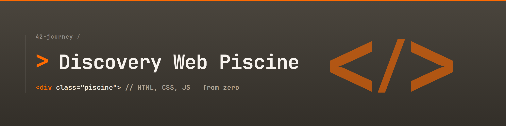

<!-- / 01. HERO BANNER / -->

<!-- / 02. SUBTITLE & CONCEPT / -->
<h3>Zero Frameworks. Pure Web Foundations.</h3>

  <b>Welcome to the 42 Discovery Web Piscine.</b> 
  <i>Mastering HTML, CSS, and vanilla JavaScript to build interactive interfaces from the ground up.</i>

 

<!-- / 03. PROJECT METADATA / -->

  <!-- Status Badge -->
  
  &nbsp;
  <!-- Duration Badge -->
  

<!-- / 04. TECH STACK / -->
### 🛠️ Core Stack
<i>The technologies powering these interactive experiences.</i>
 

  
  
  
  

 

---
<!-- / 05. ABOUT SECTION / -->
## 🚀 The Concept: Pure Web Foundations

This repository documents an intensive sprint at 42, focused strictly on mastering the core pillars of web development: HTML, CSS, and vanilla JavaScript.

By building entirely without modern frameworks, the objective is to understand the raw mechanics of the web. From configuring the underlying system environment to structuring the DOM, cascading styles, and writing dynamic scripts with JavaScript and jQuery, this is a deep dive into how the browser interprets and executes code under the hood.

 

<!-- / 06. CURRICULUM (CELLS) / -->
## 🔍 The Curriculum (Cells)

The progression is strictly linear, starting from the terminal and moving up through the front-end stack.

*Click on any Cell to access its source code and specific technical documentation.*

| Cell | Tech Focus | Technical Implementation |
| :--- | :--- | :--- |
| **[📂 Cell 00](./cell-00)** | **Shell Basics** | Command-line mastery, directory routing, and shell scripting. |
| **[📂 Cell 01](./cell-01)** | **HTML5 & CSS3** | Semantic DOM structuring, asset routing, and fundamental styling. |
| **[📂 Cell 02](./cell-02)** | **Advanced CSS** | Responsive architecture, Flexbox grids, and visual rendering properties. |
| **[📂 Cell 03](./cell-03)** | **JS & jQuery** | DOM manipulation, event handling, and dynamic state management. |

 

> 💡 Every cell operates as a standalone technical exercise, emphasizing clean syntax and strict adherence to web standards.

 

<!-- / 07. NAVIGATION PROTOCOL / -->
## 🎯 System Navigation

This repository utilizes a **Fractal Documentation Structure**. While this root file provides the macroscopic overview, each Cell contains a dedicated `README.md` breaking down the specific code logic and execution steps.

### ⚙️ Execution Flow
*   **💻 Terminal (Cell 00):** Clone the repository and execute the bash scripts directly within your CLI.
*   **🌍 Browser (Cells 01-03):** Locate the `.html` files and render them natively in any modern browser to execute the scripts and stylesheets.

 

> ⚠️ **Developer's Note:** To fully grasp the technical progression, review the code linearly. Each module lays the necessary syntax and logic foundation for the next layer of complexity.

 

---

<!-- / 08. FOOTER & CONTACT / -->

    

  <!-- 1. The Quote (The Message) -->
  <i>"&lt;div&gt; is just a container. What you put inside changes the world."</i> 🧑‍💻
  
  <!-- 2. The Space (Visual separator) -->
    

  <!-- 3. The Credits -->
   
  Crafted by <b>joolibar</b> 
  <small><samp>Creative Developer building digital experiences at 42</samp></small>  
  
  <!-- Social Badges & Return Anchor -->
  &nbsp;&nbsp;&nbsp; 
  
  © 2026 joolibar &nbsp;•&nbsp; Peer-reviewed by the community 👥, styled by Humans 🎨.

   

<!-- / 09. FINAL ANCHOR / -->
